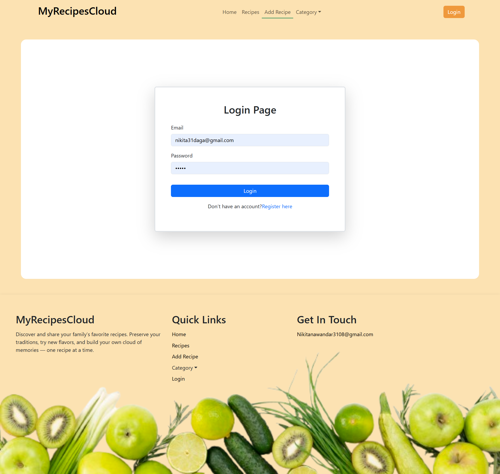
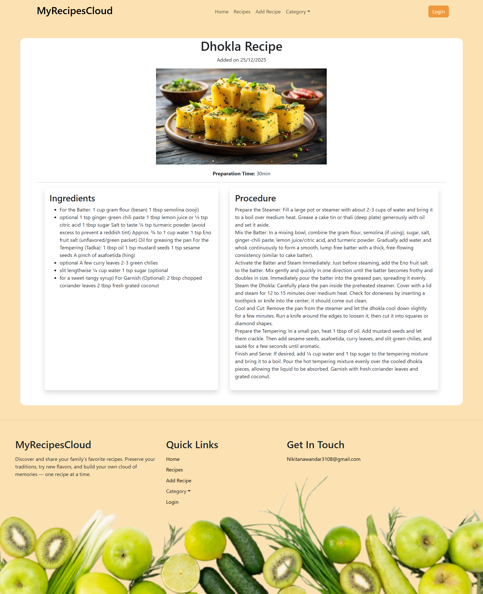
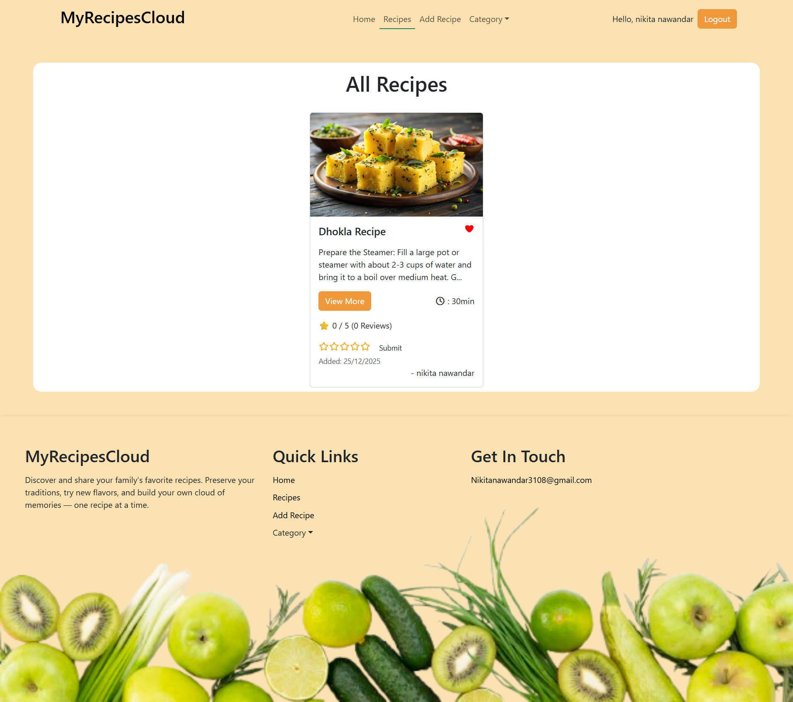
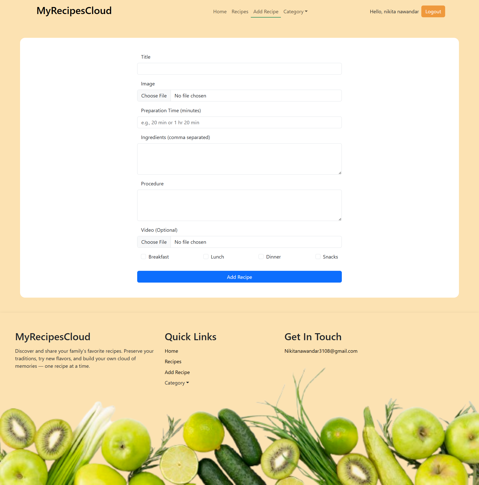

# 🍽️ MyRecipesCloud

MyRecipesCloud is a **full-stack MERN application** that allows users to discover, add, and rate recipes.  
The platform focuses on **simple authentication**, **recipe sharing**, and **community feedback through ratings**.

---

## 🚀 Live Features

### 🔐 Authentication

- User Registration & Login
- JWT-based authentication
- Secure login using HTTP-only cookies
- Logout functionality
- Logged-in user session handling via React Context API

> 🔒 Only authenticated users can **add recipes** and **submit ratings**

---

### 🍲 Recipes

- Add new recipes (only logged-in users)
- View all recipes (public)
- View recipe details
- Category-wise recipes (Breakfast, Lunch, Dinner, Snacks)
- Search recipes by keyword
- Display recipe creator name

---

### ⭐ Ratings & Reviews

- Users can view ratings without login
- Only logged-in users can submit ratings
- One recipe can receive multiple user ratings
- Average rating calculated and displayed dynamically
- Total reviews count shown per recipe

---

### 📷 Image Upload

- Recipe images uploaded using **Cloudinary**
- Secure cloud-based image storage
- Optimized image URLs used in frontend

---

### ❤️ UI & UX

- Responsive Navbar & Footer
- Conditional rendering based on login state
- Add Recipe restricted when not logged in
- Alerts & redirects for unauthorized actions
- Clean UI using Bootstrap

---

## 🛠️ Tech Stack

### Frontend

- React.js
- React Router DOM
- Axios
- Bootstrap
- React Toastify
- Font Awesome

### Backend

- Node.js
- Express.js
- MongoDB & Mongoose
- JWT Authentication
- Cookie Parser
- Multer
- Cloudinary

### Cloud Services

- Cloudinary (image upload & storage)

---

## 📂 Project Structure

MYRECIPESCLOUD
│
├── backend
│ ├── controllers
│ ├── models
│ ├── routes
│ ├── middleware
│ ├── config
│ └── server.js
│
├── frontend
│ ├── src
│ │ ├── components
│ │ ├── pages
| | |-- Images
│ │ ├── context
│ │ ├── api
│ │ └── App.js
│ └── main.js
|
|├── screenshots
│ ├── Login.png
│ ├── Home.png
│ ├── AllRecipes.png
│ ├── recipe-details.png
│ ├── AddRecipe.png
│ └── Category.png
|
└── README.md

## 📸 Screenshots

### 🔐 Login Page

### 🏠 Home Page

### 🍲 Recipe Details Page

### 🍲 All Recipe Page

### 🍲 Add Recipe Page

### 🍲 Category Page

